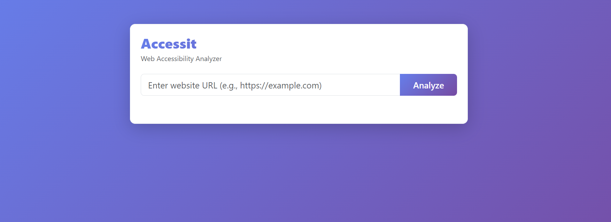
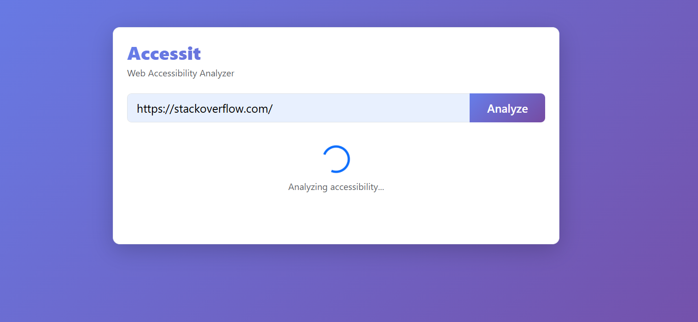
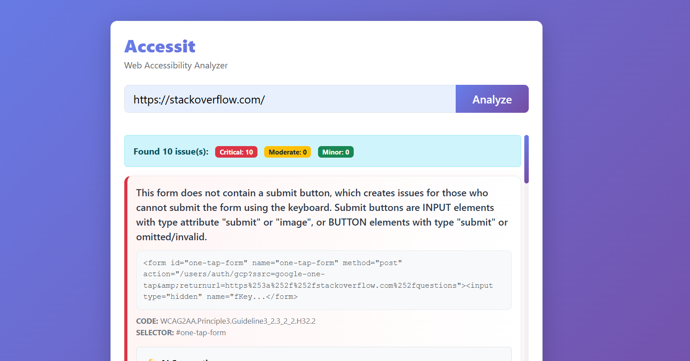

# 🌐 Accessit – Web Accessibility Analyzer

**Check website accessibility, get AI suggestions, and improve your web pages.**

Accessit is a web accessibility analyzer that evaluates website URLs for accessibility issues. Issues are categorized as **Critical, Moderate, or Minor** (Red, Yellow, Green), and it uses **Hugging Face AI APIs** to suggest fixes.

---

## 🛠️ Tech Stack

|    Frontend   |      Backend      | Tools |  AI Integration  |
| :-----------: | :---------------: | :---: | :--------------: |
| HTML, CSS, JS | Node.js + Express | Pa11y | Hugging Face API |

---

## 📦 Features

* 🔍 Analyze website URLs for accessibility issues
* 🟢 Categorize issues by severity (Critical, Moderate, Minor)
* 🤖 Get AI-based suggestions to fix accessibility errors
* 📊 Color-coded UI for easy visualization

---

## 📸 Screenshots

**🏠 Home Page**


**📋 Accessibility Report**


**💬 AI Fix Suggestions**


---

## 🚀 Local Setup

### 1️⃣ Clone the repository

```bash
git clone https://github.com/your-username/Accessit.git
cd Accessit
```

### 2️⃣ Install dependencies

```bash
npm install
```

### 3️⃣ Run the project

```bash
npm start
```

Open [http://localhost:5000](http://localhost:5000) in your browser.

---

## 🧑‍💻 Author

**Kusheen Dhar**


